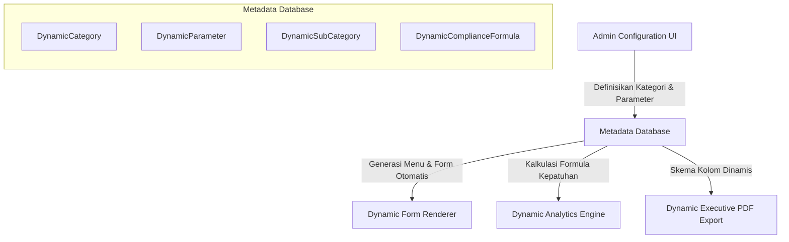

# Rencana Implementasi: Platform Kesehatan Lingkungan Dinamis (Dynamic Master Data & Forms)

Menjadikan aplikasi Kesehatan Lingkungan (Kesling) sepenuhnya **dinamis**. Alih-alih mengkode keras (*hardcode*) 6 kategori saat ini (TPP, SPAL, SAB, Jamban, Rumah, TTU), sistem baru ini memungkinkan Administrator untuk menambah, mengubah, mengatur rumus kepatuhan, serta mendesain formulir isian laporan secara langsung dari UI Admin.

---

## 💡 Gambaran Arsitektur Baru: Dinamis vs Statis



---

## 🛠️ Usulan Perubahan Database (Prisma Schema)

Untuk mendukung fleksibilitas penuh, kita akan membuat sekumpulan tabel dinamis baru yang berdampingan (*co-exist*) dengan skema saat ini agar transisi data berjalan mulus tanpa merusak fungsionalitas yang ada.

### 1. Model Metadata Kategori & Parameter
```prisma
// Kategori Indikator Laporan (e.g. TPP, SPAL, SAB, Kualitas Udara)
model DynamicCategory {
  id          Int                  @id @default(autoincrement())
  nama        String               @unique
  code        String               @unique // e.g. "tpp", "spal", "kualitas_udara"
  deskripsi   String?              @db.Text
  icon        String               @default("📋") // Emoji atau ikon class
  urutan      Int                  @default(0)
  isRowBased  Boolean              @default(true) // True = spreadsheet grid (TPP/SPAL), False = single card form (Rumah Sehat)
  createdAt   DateTime             @default(now())
  updatedAt   DateTime             @updatedAt

  subCategories DynamicSubCategory[]
  parameters    DynamicParameter[]
  laporan       DynamicLaporan[]
  formula       DynamicComplianceFormula?
  targets       DynamicTarget[]

  @@map("dynamic_category")
}

// Sub-Kategori / Baris Spreadsheet (e.g. Jasa Boga, Depot Air Minum, dll)
model DynamicSubCategory {
  id          Int             @id @default(autoincrement())
  categoryId  Int
  nama        String
  urutan      Int             @default(0)
  createdAt   DateTime        @default(now())
  updatedAt   DateTime        @updatedAt

  category    DynamicCategory @relation(fields: [categoryId], references: [id], onDelete: Cascade)
  values      DynamicLaporanValue[]

  @@unique([categoryId, nama])
  @@map("dynamic_sub_category")
}

// Parameter / Field Input di dalam Kategori (e.g. "Jumlah Diperiksa", "Laik Jumlah")
model DynamicParameter {
  id           Int             @id @default(autoincrement())
  categoryId   Int
  nama         String
  code         String          // e.g. "diperiksa", "laik_jumlah"
  type         String          @default("NUMBER") // NUMBER, TEXT, BOOLEAN, DECIMAL
  required     Boolean         @default(true)
  urutan       Int             @default(0)
  config       Json?           // Untuk opsi pilihan (select), validasi batas min/max, dll
  createdAt    DateTime        @default(now())
  updatedAt    DateTime        @updatedAt

  category     DynamicCategory @relation(fields: [categoryId], references: [id], onDelete: Cascade)
  values       DynamicLaporanValue[]

  @@unique([categoryId, code])
  @@map("dynamic_parameter")
}

// Rumus Perhitungan Persentase Capaian Kepatuhan
model DynamicComplianceFormula {
  id              Int             @id @default(autoincrement())
  categoryId      Int             @unique
  numeratorCode   String          // Kode parameter pembilang, e.g. "laik_jumlah"
  denominatorCode String          // Kode parameter penyebut, e.g. "diperiksa"
  description     String?         // Penjelasan rumus, e.g. "(Laik / Diperiksa) * 100"
  createdAt       DateTime        @default(now())
  updatedAt       DateTime        @updatedAt

  category        DynamicCategory @relation(fields: [categoryId], references: [id], onDelete: Cascade)

  @@map("dynamic_compliance_formula")
}
```

### 2. Model Data Laporan & Nilai Dinamis
```prisma
// Data Utama Laporan Bulanan Puskesmas
model DynamicLaporan {
  id           Int             @id @default(autoincrement())
  puskesmasId  Int
  categoryId   Int
  bulan        Int
  tahun        Int
  status       StatusLaporan   @default(DRAFT)
  catatan      String?         @db.Text
  createdBy    Int?
  updatedBy    Int?
  createdAt    DateTime        @default(now())
  updatedAt    DateTime        @updatedAt

  category     DynamicCategory @relation(fields: [categoryId], references: [id])
  values       DynamicLaporanValue[]

  @@unique([puskesmasId, categoryId, bulan, tahun])
  @@map("dynamic_laporan")
}

// Nilai Riil Parameter Laporan
model DynamicLaporanValue {
  id            Int                 @id @default(autoincrement())
  laporanId     Int
  parameterId   Int
  subCategoryId Int?                // Null jika kategori isRowBased = false (e.g. Rumah Sehat)
  value         String              // Nilai disimpan sebagai string, diparsing di aplikasi sesuai tipe parameter
  createdAt     DateTime            @default(now())
  updatedAt     DateTime            @updatedAt

  laporan       DynamicLaporan      @relation(fields: [laporanId], references: [id], onDelete: Cascade)
  parameter     DynamicParameter    @relation(fields: [parameterId], references: [id])
  subCategory   DynamicSubCategory? @relation(fields: [subCategoryId], references: [id], onDelete: Cascade)

  @@unique([laporanId, parameterId, subCategoryId])
  @@map("dynamic_laporan_value")
}

// Target Bulanan Khusus Puskesmas berbasis Kategori Dinamis
model DynamicTarget {
  id           Int             @id @default(autoincrement())
  tahun        Int
  categoryId   Int
  puskesmasId  Int?            // Null jika Target Global baseline
  targetPersen Float           @default(80.0)
  createdAt    DateTime        @default(now())
  updatedAt    DateTime        @updatedAt

  category     DynamicCategory @relation(fields: [categoryId], references: [id], onDelete: Cascade)

  @@unique([tahun, categoryId, puskesmasId])
  @@map("dynamic_target")
}
```

---

## 🎨 Desain Pembaruan Antarmuka (UI/UX)

### 1. Panel Administrasi Baru: Master Builder Kategori & Parameter
*   **Halaman Pengelolaan Kategori (`/settings/master-kategori`)**:
    *   Tabel daftar semua kategori aktif (TPP, SPAL, Jamban, dll).
    *   Tombol `"Tambah Kategori Baru"` yang membuka modal form.
    *   Fitur pilihan gaya visual: ikon/emoji, urutan menu, dan tipe input (`Spreadsheet Grid` vs `Card Form Fields`).
*   **Parameter & Sub-Kategori Builder**:
    *   Visual Builder di mana admin bisa klik `"Tambah Field Parameter"` (contoh: Nama: *Layani Pembeli*, Code: *layani*, Type: *Angka/Pilihan*).
    *   Pengaturan Rumus Capaian: Interface sederhana di mana admin menentukan parameter mana yang dibagi parameter mana untuk menghasilkan persentase kepatuhan (contoh: `(laik_jumlah / diperiksa) * 100`).

### 2. Dynamic Form Renderer (`/laporan/[categoryCode]`)
*   Sistem router Next.js dinamis yang menangkap kode kategori.
*   Membaca struktur metadata dari API.
*   **Kasus Grid Spreadsheet (`isRowBased: true`)**:
    *   Merender lembar kerja spreadsheet yang persis seperti input TPP/SPAL saat ini: Baris adalah daftar `DynamicSubCategory` dan kolom adalah `DynamicParameter`.
    *   Mendukung entri cepat dengan keyboard navigasi (arrow keys) dan autosave berkedip hijau lembut.
*   **Kasus Form Card (`isRowBased: false`)**:
    *   Merender form vertikal rapi terbagi dalam grid dua kolom (seperti Rumah Sehat) berbasis parameter yang didaftarkan.

### 3. Dynamic Reports & Executive Export
*   **Dashboard Operator & Admin**:
    *   Grafik Recharts dan Summary Cards dimuat secara dinamis. Kode akan melakukan map terhadap `DynamicCategory.findMany()` untuk membuat tabs dan visual summary gauges.
*   **Laporan Eksekutif PDF Adaptif**:
    *   Modul `jspdf` akan membaca metadata kategori dan merender sub-tabel secara dinamis. Jika ada kategori baru (contoh: "Kualitas Udara"), PDF secara cerdas akan menyisipkan section baru, header tabel berdasarkan parameter aktif, dan menghitung total capaian otomatis!

---

## 📋 Rencana Tahapan Eksekusi

### Tahap 1: Migrasi Database & Seeding Data Awal (Seamless Transition)
*   Membuat skema tabel dinamis baru di `schema.prisma`.
*   Membuat script **Prisma Seeding** untuk membaca data 6 kategori statis yang ada saat ini dan menyalinnya ke dalam struktur tabel dinamis (`DynamicCategory`, `DynamicParameter`, dll).
*   **Penting**: Aplikasi lama tetap berjalan normal tanpa gangguan selama proses migrasi ini.

### Tahap 2: API Gateway & Metadata Handler
*   Membuat endpoint `/api/dynamic/schema` untuk mengembalikan metadata menu dan konfigurasi parameter lengkap bagi klien.
*   Membuat endpoint `/api/dynamic/laporan/[categoryCode]` untuk penanganan CRUD data laporan dinamis.

### Tahap 3: Pembuatan UI Master Builder & Renderer Dinamis
*   Membangun dashboard admin `/settings/master-kategori` lengkap dengan interface interaktif untuk drag-and-drop parameter.
*   Membuat modul `/laporan/[categoryCode]/page.tsx` yang secara otomatis menyesuaikan tampilan berdasarkan tipe kategori (`isRowBased`).

### Tahap 4: Mengalihkan Dashboard & Laporan ke Mesin Dinamis
*   Mengubah dashboard perbandingan (`/perbandingan`) dan dashboard operator (`/dashboard-pkm`) agar memetakan data secara dinamis dari API Schema.
*   Memperbarui mesin generator PDF (`exportExecutivePDF`) agar menghasilkan tabel adaptif berdasarkan skema dinamis yang aktif.

---

## ❓ Open Questions (Mohon Umpan Balik)

> [!IMPORTANT]
> Mohon berikan masukan Anda untuk poin-poin berikut sebelum kita memulai pengerjaan:
> 
> 1. **Bagaimana dengan Data Historis?**
>    Apakah kita harus menulis skrip migrasi otomatis untuk memindahkan data laporan lama (TPP, SPAL, dll) ke tabel dinamis baru agar riwayat laporan tetap utuh? *(Sangat Direkomendasikan)*
> 
> 2. **Apakah Desain Menu Samping (Sidebar) Perlu Disesuaikan?**
>    Saat ini menu laporan di sidebar dicantumkan satu per satu (TPP, SPAL, SAB, Jamban, Rumah, TTU). Apakah menu ini harus dimuat secara dinamis dari database (sehingga kategori baru otomatis muncul di sidebar), atau tetap tertulis statis dan hanya halamannya saja yang dinamis? *(Saran: Dimuat dinamis agar fleksibilitas 100% tercapai)*
> 
> 3. **Kompleksitas Rumus Kepatuhan**:
>    Apakah pembagian sederhana `(numerator / denominator) * 100` sudah cukup mencakup semua jenis laporan saat ini dan masa depan, atau apakah kita perlu mendukung formula matematika yang lebih kompleks (seperti penjumlahan bersyarat)?
